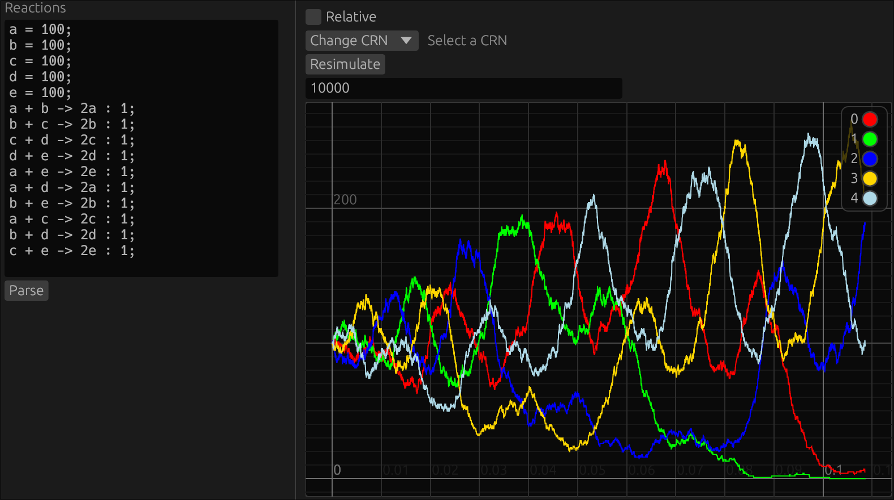

# crn

`crn` can simulate both stochastic and deterministic CRNs with `StoCrn` and `DetCrn`, respectively.

To create your own CRN, first declare the initial counts of each molecule:

`a = 10;`

Then add the reactions, each optionally followed by a rate (in this case, 10):

`a + b -> 2c : 10;`

Try the examples for a graphical demonstration!

`$ cargo run --release --example sto`

